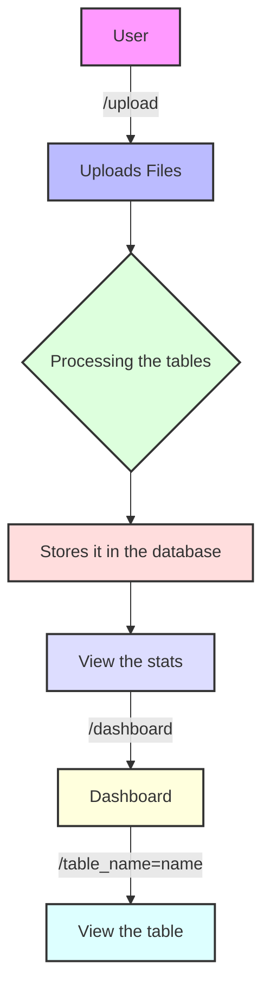
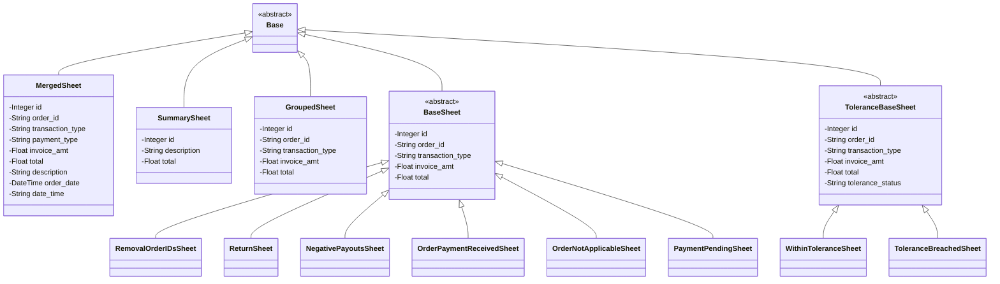

# Datacraft
This is a data visualization tool done as a part of the internship assignment for [Interface Labs](https://www.linkedin.com/company/interface-ai-labs/). Merchants/traders can upload their payment data and the web app crunches the tables and data to provide meaningful numbers and visualizations. <br /> <br />
You can find the hiring task [here](https://theinterfacecompany.notion.site/Full-Stack-Developer-SDE-Intern-87b68e73cdcd465fb4fbbe9b87e09570).

## Getting Started
- Clone the repository using the command
```
git clone https://github.com/helios2003/Datacraft.git
```
- Go into ``Datacraft`` directory.
### Setting it up With Docker-Compose
- Create a file named ``.env`` at the root and fill it with:
```
host_name="postgres"
```
- Run the command ``docker compose up -d``, This will help in creating and running all the 4 containers.
- The services will be available at the given ports as mentioned in the ``docker-compose.yaml``.

### Setting it up Without Docker-Compose

#### Frontend
- Go into the ``frontend`` folder.
- Run ``npm install`` to install the dependencies.
- Run ``npm run dev``. By default the frontend runs on ``http://localhost:8000``.

#### Backend
- Go into the ``backend`` folder.
- Create a [virtual environment](https://docs.python.org/3/library/venv.html) and activate it.
- Install the dependencies using the command ``pip install -r requirements.txt``.
- Create a file named ``.env`` at the root and fill it with:
```
host_name="localhost"
```
#### Database
- Pull the PostgreSQL image from [DockerHub](https://hub.docker.com/_/postgres).
- Spin it up and connect it with the backend.
<br /> <br />

#### To View the Tables in pgAdmin4 
Follow the given steps:
- In the home page of pgadmin4, click on ``Add Servers`` icon.
- This will open a pop up which contains few inputs to be given.
- Give the following inputs.

```conf
"Name": "local db",
"Group": "Server",
"Port": 5432,
"Username": "root",
"Host": "postgres_ilabs",
"SSLMode": "prefer",
"password": "example"
"MaintenanceDB": "postgres"
```
## Demo Video
<video width="640" height="240" controls>
  <source src="assets/demo.mp4" type="video/mp4">
  Your browser does not support the video tag.
</video>

## Tasks Completed
### Data Processing
- [x] Created the Merged Sheet.
- [x] Grouped the dataset.
- [x] Created the 6 main tables.
- [x] Created the Tolerance Level table.
### Frontend
- [x] Made a responsive UI.
- [x] Used Typescript.
- [x] Created summaries to view the processed tables.

### Backend
- [x] Created endpoints for processing the uplaoding the dataset to database.
- [x] Designed functions for all the ELT processes.

### Deployment
- [x] Containerized the frontend, backend and the database.
- [x] Created the ``docker-compose.yml`` file.
- [x] Implemented pre commit hooks.

## Tasks to be completed
- [ ] Implementing Pydantic for type checking and data validation.
- [ ] Setting up the CD pipeline.

## Design/Flow of the Project



## API Design
I have used REST APIs for the project. You can find the spec file [here](backend/openapi_spec.yaml).

## Schema Design
The database schema design can be found below.



## List of issues and potential improvements
- The UI of the pages can be improved.
- A loader can be shown while the processing is happening because the processing and generating the tables takes roughly 8-10 seconds.
- Adding data validation for inserting into the database.
- Pagination can be done for the tables shown.
- Automatic deployment to AWS or DockerHub on every push to main branch can be added.

## Tech Stack
- FastAPI in the backend + Pandas for the data preprocessing.
- NextJS in the frontend.
- PostgreSQL as the database.
  

  
